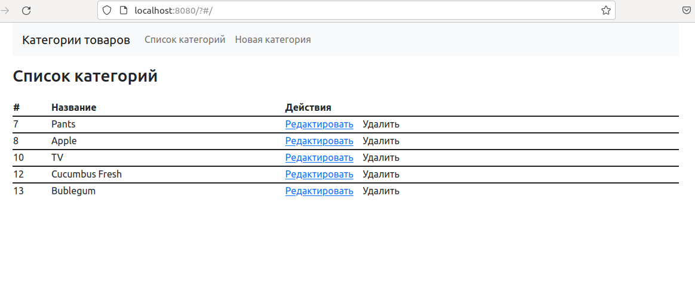
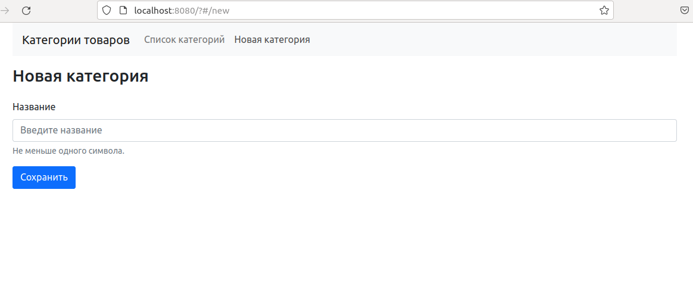
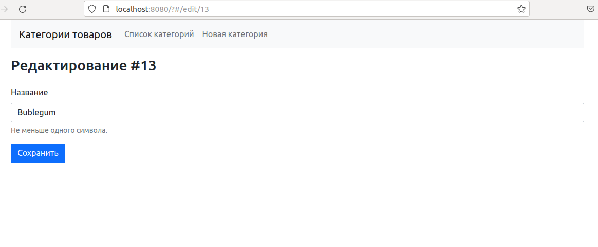

# Тестовое задание

SPA приложение с фронтом на Vue.js включающее страницы чтения списка категорий, создания, удаления, редактирования.
Backend на Symfony включющий REST API и тесты на него.
Развертнывание через Docker Compose, включает: nginx, mysql, php-fpm контейнеры

Технологии: Vue3, VueRouter4, Bootstrap5, Symfony5.4, а также: Doctrine, DoctrineMigrations, MySql и Nginx.

## Требования

На хосте должно быть установлен: Docker, DockerCompose, php7.2, git и composer

## Установка

### Шаг 1. Переходим в папку проекта, выполняем

`composer install` (сброка производится вне контейнера, т.к. там нет гита)

### Шаг 2. Запускаем приложение

`docker-compose up` (при необходимост от рута)

### Шаг 3. Выполняем миграции (база создается на этапе инициализации контейнера с mysql)

```
docker exec -it alfabanktest_php_1 /bin/bash
cd ../project/
php bin/console doctrine:migrations:migrate
```

### Шаг 4. Выполняем тесты, из контейнера из той же папки что и на предыдущем шаге

Создаем тестовую базу и схему

```
php bin/console --env=test doctrine:database:create
php bin/console --env=test doctrine:schema:create
```

Выполняем тесты

`php bin/phpunit`

### Шаг 5. Проверяем работу приложения

Переходим в браузере по адресу http://localhost:8080

#### Список категорий



#### Новая категория



#### Редактирование


